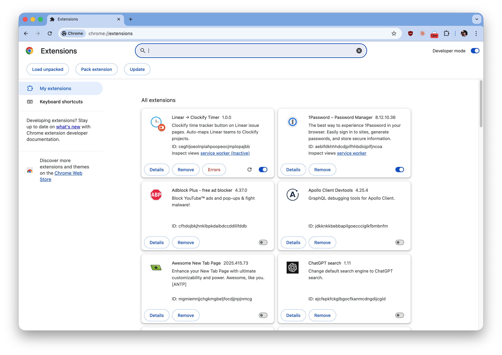
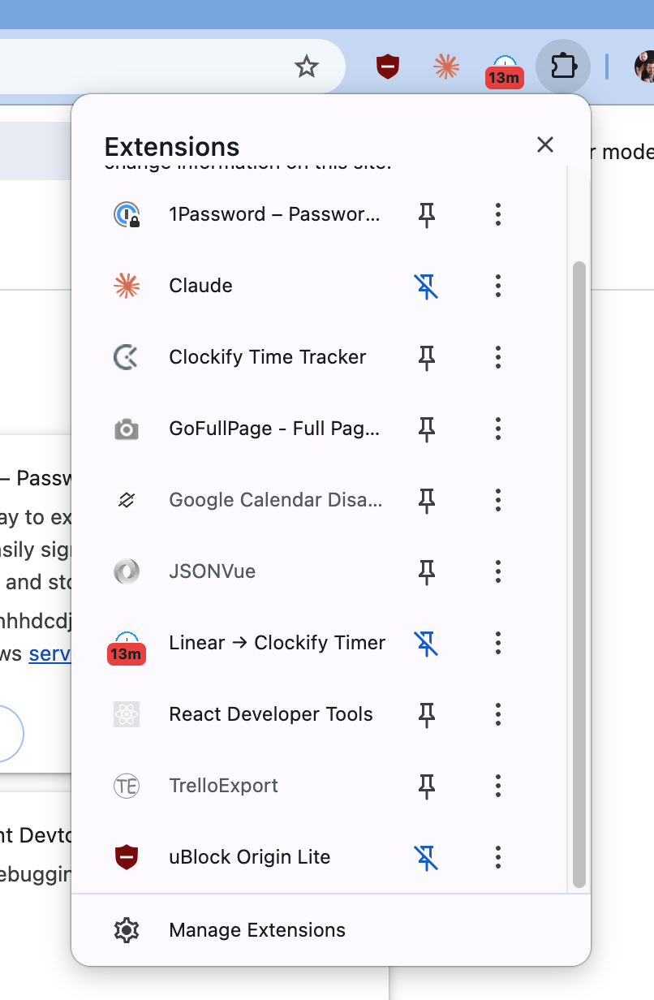

# Linear → Clockify Timer — Telepítési útmutató

Ez a Chrome extension Clockify time-tracker gombot tesz a Linear issue és HelpScout conversation oldalakra. Indítja/leállítja a timert, automatikusan kitölti a projektet és a leírást.

> Az extension még nincs fent a Chrome Web Store-on (review alatt), ezért **kézzel kell telepíteni** egy letöltött zip fájlból. Ez egyszeri ~5 perc.

## 1. Zip letöltése

Menj a letöltő oldalra és nyomd meg a nagy letöltés gombot:

**→ https://guestguru.github.io/linear-clockify/**

Vagy közvetlenül a legfrissebb release fájlra:

**→ https://github.com/GuestGuru/linear-clockify/releases/latest/download/linear-clockify.zip**

## 2. Zip kicsomagolása

**Csomagold ki egy olyan mappába, ahol hosszú távon is lesz** — például:

- macOS: `~/Applications/linear-clockify/` vagy `~/Documents/chrome-extensions/linear-clockify/`
- Windows: `C:\ChromeExtensions\linear-clockify\`

> ⚠️ **Fontos:** a kicsomagolás után **ne mozgasd és ne töröld** ezt a mappát! A Chrome minden indításkor innen olvassa be az extensiont. Ha elmozdítod, az extension eltűnik és újra kell tölteni.

A kicsomagolás után a mappában ilyen fájloknak kell lenniük:

```
linear-clockify/
├── manifest.json
├── background.js
├── content.js
├── hs-content.js
├── popup.html
├── options.html
├── icons/
└── ...
```

## 3. Developer mode + Load unpacked

1. Nyisd meg a Chrome-ban: `chrome://extensions/`
2. A jobb felső sarokban kapcsold be a **Developer mode** (Fejlesztői mód) kapcsolót
3. Bal felül megjelenik 3 gomb — kattints a **Load unpacked** (Kicsomagolt bővítmény betöltése) gombra



4. A megnyíló mappaválasztóban **válaszd ki azt a mappát, amelyikben közvetlenül ott van a `manifest.json`** (pl. `linear-clockify/`)
5. Az extensionnek meg kell jelennie a listában **Linear → Clockify Timer** néven

## 4. Extension kitűzése (pin)

Hogy mindig lásd az ikont, tűzd ki a toolbarra:

1. Kattints a 🧩 **puzzle ikonra** a Chrome jobb felső sarkában
2. A listában keresd meg a **Linear → Clockify Timer** sort
3. Kattints mellette a **pin ikonra** (áthúzott pin → normál pin)



Ezután az extension ikonja megjelenik a címsor jobb oldalán, onnan egy kattintással elérhető.

## 5. API kulcsok beszerzése

Az extension két API kulcsot kér a beállításokban.

### Clockify API key

1. Menj ide: **https://app.clockify.me/manage-api-keys**
2. Ha még nincs aktív kulcsod: kattints **Generate** gombra
3. Másold ki a kulcsot (egyszer látszik, érdemes jelszókezelőbe menteni)

### Linear API key

1. Menj ide: **https://linear.app/gghq/settings/account/security**
2. Görgess a **Personal API keys** szekcióhoz
3. **New API key** → adj neki egy nevet (pl. `linear-clockify-extension`)
4. Másold ki a kulcsot (ez is csak egyszer látszik!)

## 6. API kulcsok megadása az extensionben

1. Kattints **jobb gombbal** az extension ikonjára → **Options**
   *(vagy: `chrome://extensions/` → **Linear → Clockify Timer** kártya → **Details** → **Extension options**)*
2. Illeszd be a **Clockify API key** és **Linear API key** mezőkbe a kulcsokat
3. **Mentés**

## 7. Használat

1. Nyiss egy Linear issue-t vagy HelpScout conversationt
2. Kattints az extension ikonjára a toolbaron
3. A popup tetején megjelenik a **▶ Start** gomb → kattints rá → elindul a Clockify timer a megfelelő projekttel és leírással
4. Stop ugyanúgy a popupból

Részletes funkcióleírás: [README.md](../README.md).

## Frissítés új verzióra

Ha új release jött ki:

1. Töltsd le az új zipet (1. pont)
2. Csomagold ki **ugyanabba a mappába**, felülírva a régi fájlokat
   *(vagy: töröld a régi mappa tartalmát és csomagold oda az újat)*
3. `chrome://extensions/` → **Linear → Clockify Timer** kártyán a **🔄 Reload** gomb
4. Az új verzió azonnal aktív

## Gyakori hibák

**„This extension may have been corrupted" vagy „Load unpacked failed"**
→ Valószínűleg nem a megfelelő mappát választottad ki. Azt a mappát kell kiválasztani, amelyikben **közvetlenül ott van** a `manifest.json`.

**„Developer mode extensions" figyelmeztetés Chrome indításkor**
→ Ez normál, mert nem a Chrome Web Store-ból telepítettük. Nyugodtan nyomd meg a **Keep** / **Maradjon** gombot.

**Eltűnt az extension Chrome újraindítás után**
→ A kicsomagolt mappát valaki/valami elmozdította vagy törölte. Csomagold ki újra egy stabil helyre és töltsd be újra (Load unpacked).

**„Invalid API key" hiba**
→ Ellenőrizd az Options oldalon, hogy a helyes kulcsot másoltad-e be, szóközök nélkül. Ha kétséges, generálj újat.

**Nem jelenik meg az extension ikonja a toolbaron**
→ Kattints a 🧩 puzzle ikonra (4. lépés), és tűzd ki onnan.
